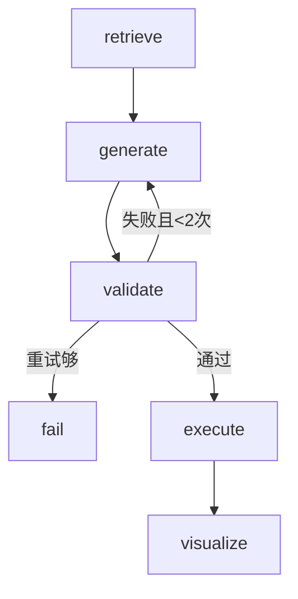

# NL2SQL 数据分析 Agent

> 基于 LangGraph 状态图 + Schema RAG 的自然语言数据库查询系统

用户用自然语言提问,系统自动生成 SQL、安全审核、执行查询、返回可视化图表。

## 系统架构

```
用户问题
  ↓ POST /query
FastAPI 后端 (app/main.py)
  ↓
LangGraph 状态图 (agent/graph.py)
  ├── retrieve  → Schema RAG 检索(DDL/业务规则/示例SQL)
  ├── generate  → LLM 生成 SQL
  ├── validate  → 双层审核(规则层 + LLM复核)
  │     └── 失败 → 回炉重生成(最多2次)
  ├── execute   → SQLite 执行
  └── visualize → 自动图表决策
  ↓
JSON 响应 {sql, 审核结果, 数据, 图表配置}
```

## 技术栈

| 组件 | 技术 | 用途 |
|---|---|---|
| Agent 编排 | LangGraph | 状态图 + 条件边(回炉机制) |
| 向量检索 | ChromaDB | Schema RAG:表结构/业务规则/示例SQL |
| LLM | DeepSeek V4 Flash | SQL 生成 + 审核复核 |
| 后端 | FastAPI | REST API + Swagger 文档 |
| 数据库 | SQLite | 零依赖,本地运行 |

## 快速开始

```bash
# 1. 安装依赖
pip install -r requirements.txt

# 2. 配置环境变量
cp .env.example .env
# 编辑 .env,填入 DEEPSEEK_API_KEY

# 3. 生成演示数据
python data/gen_data.py

# 4. 构建向量库
python agent/schema_rag.py

# 5. 启动服务
cd app && uvicorn main:app --reload --port 8000

# 6. 测试
curl -X POST http://localhost:8000/query \
  -H "Content-Type: application/json" \
  -d '{"question": "华东区上月销售额Top3商品"}'
```

打开 http://localhost:8000/docs 可视化测试接口。

## 演示数据

3 张表,5万行订单:

| 表 | 字段 | 说明 |
|---|---|---|
| products | id, name, category, price | 82个商品,8个类目 |
| regions | id, name | 7大地理分区 |
| orders | id, order_no, product_id, region_id, quantity, amount, order_date | 5万笔订单 |

## 核心设计

### 1. Schema RAG(三类知识)

把数据库知识分三类向量化,按语义相似度检索:

| 知识类型 | 内容 | 解决的问题 |
|---|---|---|
| DDL(地图) | 表结构 + 字段注释 | LLM 知道有哪些表、哪些字段 |
| 业务文档(词典) | "销售额=SUM(amount)"等规则 | LLM 懂业务术语 |
| 问题-SQL对(真题) | 历史问答示例 | LLM 学会写SQL的格式 |

### 2. SQL 安全审核(双层)

| 层 | 机制 | 拦截什么 | 速度 |
|---|---|---|---|
| 规则层 | 纯代码检查 | DELETE/UPDATE/DROP等危险操作 | 毫秒级 |
| LLM复核层 | 语义判断 | 答非所问等语义错误 | 1~3秒 |

规则层先过滤明显危险,通过后才调LLM——省钱省时。

### 3. LangGraph 自我纠错

审核失败 → 带错误信息回到 generate 节点重写 → 最多重试2次。



## API 文档

### POST /query

请求:
```json
{"question": "华东区上月销售额Top3商品"}
```

响应:
```json
{
  "question": "华东区上月销售额Top3商品",
  "sql": "SELECT p.name, SUM(o.amount) AS sales ...",
  "validation_passed": true,
  "validation_errors": [],
  "result_columns": ["name", "sales"],
  "result_rows": [["运动相机", 150037.16], ...],
  "chart": {"chart_type": "bar", "labels": [...], "values": [...]}
}
```

## 项目结构

```
nl2sql_agent/
├── agent/
│   ├── schema_rag.py    # Schema RAG:向量化检索
│   └── graph.py         # LangGraph 状态图编排
├── app/
│   └── main.py          # FastAPI 后端接口
├── data/
│   ├── gen_data.py      # 数据生成脚本
│   └── ecommerce.db     # SQLite 数据库
├── chroma_data/         # ChromaDB 向量库
├── requirements.txt
└── .env.example
```

## 简历故事

> **项目一**证明我会「从文档里找答案」(RAG + 企业级工程化);
> **项目二**证明我会「从数据里找答案」(LangGraph + NL2SQL + 安全审核 + 可视化),
> 两者都体现 LLM 应用开发能力,技术标签完全不同,形成互补。

### 技术标签对比

| | 项目一(金融知识问答) | 项目二(NL2SQL数据分析) |
|---|---|---|
| 数据形态 | 非结构化文档 | 结构化数据库 |
| 核心技术 | RAG 文档检索 | NL2SQL + 安全审核 |
| 编排框架 | HelloAgents | LangGraph |
| 输出 | 文字回答 | SQL + 图表 + 数据 |
| 评测 | 主观准确性 | 客观测准率 |

### 面试要点

1. **Schema RAG**:DDL + 业务文档 + 问题SQL对 三类知识向量检索
2. **LangGraph**:StateGraph + 条件边 + 自我纠错回炉机制
3. **SQL安全**:规则层(危险词/表名白名单/LIMIT) + LLM复核层 双层审核
4. **可视化**:根据查询结果自动决策柱状图/折线图/表格
