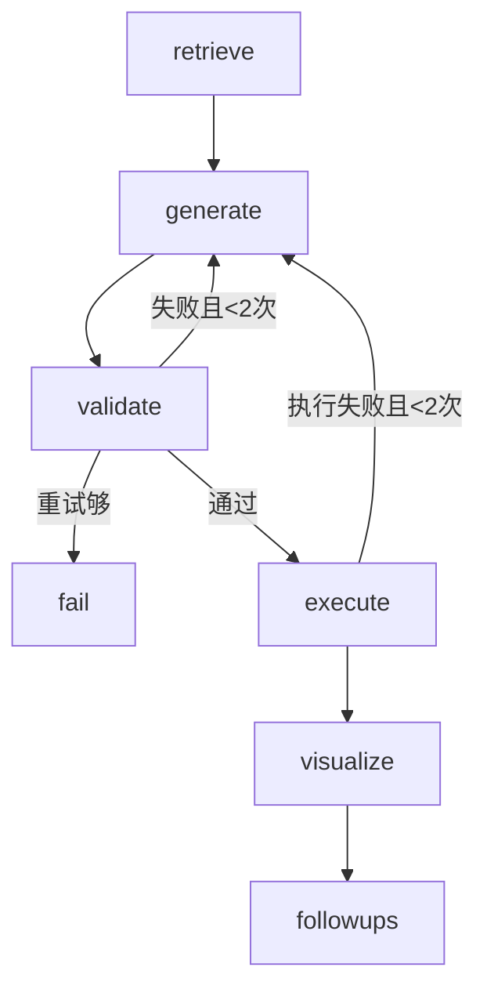

# NL2SQL 数据分析 Agent

> 基于 Schema RAG + 普通 Python 编排 + 意图识别的自然语言数据库查询系统

用户用自然语言提问,系统自动识别意图、生成 SQL、安全审核、执行查询、返回可视化图表与深度分析。

## 系统架构

```
用户问题
  ↓ POST /query
FastAPI 后端 (app/main.py)
  ↓
意图识别 (agent/graph.py)
  ├── off_topic(无关)      → 礼貌拒绝 + 引导电商问题
  ├── inventory_query(了解) → LLM 直接回答(不查 SQL)
  └── data_analysis(分析)   → 完整数据分析流程
        ├── retrieve  → Schema RAG 检索(DDL/业务规则/示例SQL)
        ├── generate  → LLM 生成 SQL(Function Calling 结构化输出)
        ├── validate  → 双层审核(规则层 + LLM复核)
        │     └── 失败 → 回炉重生成(最多2次)
        ├── execute   → SQLite 执行(失败也回炉)
        ├── visualize → LLM 图表决策(bar/line/pie/table)
        ├── followups → 相关追问生成
        └── cache     → 结果缓存(数据版本检测自动失效)
  ↓
JSON 响应 {intent, sql, 审核结果, 数据, 图表配置, 追问}
```

## 技术栈

| 组件 | 技术 | 用途 |
|---|---|---|
| Agent 编排 | 普通 Python 函数 + while 循环 | 流水线 + 回炉机制(零框架依赖) |
| 意图识别 | Function Calling 三分类 | 数据分析/了解性/无关 分流 |
| LLM 输出 | Function Calling | SQL/审核/图表/追问/意图 结构化输出 |
| 向量检索 | ChromaDB | Schema RAG:表结构/业务规则/示例SQL |
| LLM | Qwen-Plus (阿里云百炼) | SQL 生成 + 审核复核 + 图表决策 |
| 后端 | FastAPI | REST API + Swagger 文档 |
| 数据库 | SQLite | 零依赖,本地运行 |
| 缓存 | 内存 + 数据版本检测 | 相同问题秒回,数据变更自动失效 |

## 快速开始

```bash
# 1. 安装依赖
pip install -r requirements.txt

# 2. 配置环境变量
cp .env.example .env
# 编辑 .env,填入 LLM_API_KEY(阿里云百炼)

# 3. 生成演示数据
python data/gen_data.py

# 4. 构建向量库
python agent/schema_rag.py

# 5. 启动服务
cd app && uvicorn main:app --reload --port 8000

# 6. 测试
curl -X POST http://localhost:8000/query \
  -H "Content-Type: application/json" \
  -d '{"question": "华东区上月销售额Top3商品"}'
```

打开 http://localhost:8000/docs 可视化测试接口。

## 演示数据

3 张表,5万行订单:

| 表 | 字段 | 说明 |
|---|---|---|
| products | id, name, category, price | 82个商品,8个类目 |
| regions | id, name | 7大地理分区 |
| orders | id, order_no, product_id, region_id, quantity, amount, order_date | 5万笔订单 |

## 核心设计

### 1. 意图识别(三分类路由)

LLM 先判断问题类型,决定处理路径:

| 意图 | 例子 | 处理 |
|---|---|---|
| data_analysis | "华东区上月销售额Top3" | 完整流程(SQL+图表+追问) |
| inventory_query | "商品有什么" | LLM 直接回答(不查 SQL) |
| off_topic | "明天天气怎么样" | 礼貌拒绝 + 引导电商问题 |

### 2. Schema RAG(三类知识)

把数据库知识分三类向量化,按语义相似度检索:

| 知识类型 | 内容 | 解决的问题 |
|---|---|---|
| DDL(地图) | 表结构 + 字段注释 | LLM 知道有哪些表、哪些字段 |
| 业务文档(词典) | "销售额=SUM(amount)"等规则 | LLM 懂业务术语 |
| 问题-SQL对(真题) | 历史问答示例 | LLM 学会写SQL的格式 |

### 3. SQL 安全审核(双层)

| 层 | 机制 | 拦截什么 | 速度 |
|---|---|---|---|
| 规则层 | 纯代码检查 | DELETE/UPDATE/DROP等危险操作 | 毫秒级 |
| LLM复核层 | 语义判断 | 答非所问等语义错误 | 1~3秒 |

规则层先过滤明显危险,通过后才调LLM——省钱省时。

### 4. 自我纠错(回炉机制)

审核失败或执行失败 → 带错误信息回到 generate 重写 → 最多重试2次。



### 5. 缓存(数据版本检测)

- 相同问题直接返回上次结果(秒回,省 API 费用)
- 数据指纹(COUNT/MAX/SUM)检测数据变更 → 自动失效
- 相对时间问题("上月"等)不缓存,保证数据新鲜

## API 文档

### POST /query

请求:
```json
{"question": "华东区上月销售额Top3商品"}
```

响应:
```json
{
  "question": "华东区上月销售额Top3商品",
  "intent": "data_analysis",
  "sql": "SELECT p.name, SUM(o.amount) AS sales ...",
  "validation_passed": true,
  "validation_errors": [],
  "result_columns": ["name", "sales"],
  "result_rows": [["运动相机", 150037.16], ...],
  "chart": {"chart_type": "bar", "labels": [...], "values": [...]},
  "followup_questions": ["...", "...", "..."]
}
```

无关问题响应:
```json
{
  "question": "明天天气怎么样",
  "intent": "off_topic",
  "answer": "不好意思,这个问题不在我的回答范围内哦~ 我是电商数据分析助手..."
}
```

## 评测

`agent/evaluate.py` 提供 101 类典型问题的自动化评测:

| 指标 | 数值 |
|---|---|
| 测试集 | 101 类典型问题 |
| 覆盖场景 | 单表/多表 JOIN/聚合/日期/TopN/分组/占比 |
| 准确率 | 94.1% |
| 平均耗时 | 7.5s |
| 对比方式 | 语义对比(忽略列名/列序,子集匹配) |

```bash
cd agent && python evaluate.py
```

## 项目结构

```
nl2sql_agent/
├── agent/
│   ├── schema_rag.py    # Schema RAG:向量化检索 + auto_train 自动学习
│   ├── graph.py         # 普通 Python 编排(意图识别 + 流水线 + 回炉循环)
│   ├── sql_validator.py # 规则层审核(危险词/语法/白名单)
│   ├── visualize.py     # LLM 图表决策(bar/line/pie/table)
│   ├── cache.py         # 结果缓存(数据版本检测自动失效)
│   └── evaluate.py      # 评测脚本(101类问题准确率)
├── app/
│   ├── main.py          # FastAPI 后端接口
│   └── index.html       # 前端页面(ECharts 图表 + 意图分流展示)
├── data/
│   ├── gen_data.py      # 数据生成脚本
│   └── ecommerce.db     # SQLite 数据库
├── chroma_data/         # ChromaDB 向量库
├── requirements.txt
└── .env.example
```

## 简历故事

> 本项目证明我会「从数据里找答案」:用户用自然语言提问,系统自动识别意图、生成 SQL、安全审核、执行查询、返回可视化图表与深度分析,形成「问数 → 画图 → 解读」的完整数据分析闭环。

### 项目亮点

| 维度 | 亮点 |
|---|---|
| 数据形态 | 结构化数据库(3 张表,5 万行订单) |
| 核心技术 | NL2SQL + Schema RAG + 双层安全审核 + 意图识别 |
| 编排方式 | 普通 Python 编排 + Function Calling(零框架依赖) |
| 输出 | SQL + 图表 + 数据 + 追问 + 缓存 |
| 评测 | 客观测准率(101 类典型问题 94.1% 通过) |

### 面试要点

1. **意图识别**:LLM 三分类路由(数据分析/了解性/无关),生产级对话系统标准设计
2. **Schema RAG**:DDL + 业务文档 + 问题SQL对 三类知识向量检索 + auto_train 自动学习
3. **Function Calling**:SQL/审核/图表/追问/意图 全部结构化输出,消除解析脆弱性
4. **SQL安全**:规则层(危险词/表名白名单/LIMIT) + LLM复核层 双层审核
5. **自我纠错**:审核失败/执行失败 → 带错误回炉重写(最多2次)
6. **可视化**:LLM 决策柱状图/折线图/饼图/表格
7. **缓存**:数据版本检测,相同问题秒回,数据变更自动失效
8. **评测**:101 类典型问题 94.1% 通过(评测驱动开发,发现并修复多个真实 bug)
